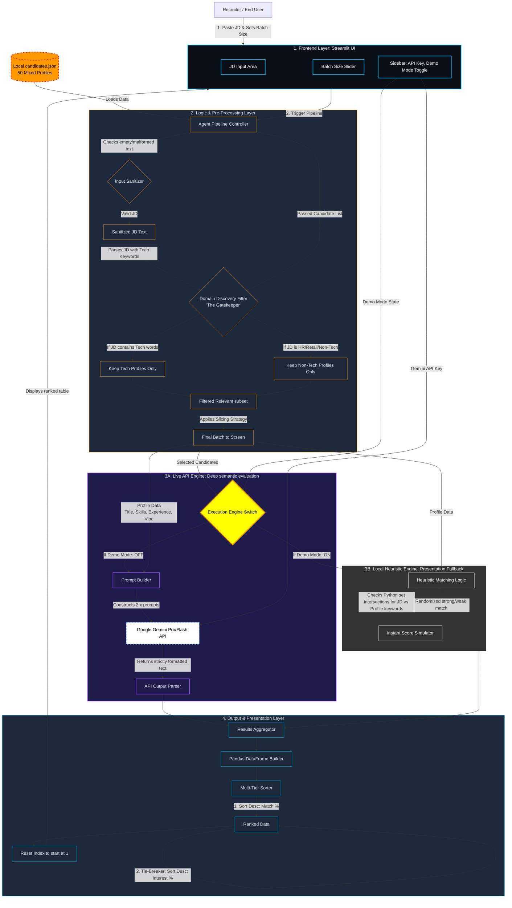

```mermaid
graph TD
    %% Define System Actors and Entry Points
    Recruiter[Recruiter / End User] -->|1. Paste JD & Sets Batch Size| StreamlitUI[Streamlit Web Frontend]
    
    subgraph StreamlitUI [1. Frontend Layer: Streamlit UI]
        JD_Input[JD Input Area]
        Slider[Batch Size Slider]
        ConfigSettings[Sidebar: API Key, Demo Mode Toggle]
    end

    %% Define the core pipeline controller and inputs
    StreamlitUI -->|2. Trigger Pipeline| PipelineManager[Agent Pipeline Controller]
    LocalCandidatesDB[(Local candidates.json<br/>50 Mixed Profiles)] -->|Loads Data| PipelineManager

    subgraph LogicalFiltering [2. Logic & Pre-Processing Layer]
        %% Stage 1: Input & Sanitization
        PipelineManager -->|Checks empty/malformed text| Sanitizer{Input Sanitizer}
        Sanitizer -->|Valid JD| SanitizedJD[Sanitized JD Text]
        
        %% Stage 2: Domain Discovery Filter (The Gatekeeper)
        SanitizedJD -->|Parses JD with Tech Keywords| DomainFilter{Domain Discovery Filter<br/>'The Gatekeeper'}
        PipelineManager -->|Passed Candidate List| DomainFilter
        
        %% Categorization Logic
        DomainFilter -->|If JD contains Tech words| KeepTech[Keep Tech Profiles Only]
        DomainFilter -->|If JD is HR/Retail/Non-Tech| KeepNonTech[Keep Non-Tech Profiles Only]
        
        %% Slicing Strategy (Start/End/Random)
        KeepTech --> FilteredBatch[Filtered Relevant subset]
        KeepNonTech --> FilteredBatch
        FilteredBatch -->|Applies Slicing Strategy| BatchSelector[Final Batch to Screen]
    end

    %% Define the execution engines
    BatchSelector -->|Selected Candidates| ExecutionEngine{Execution Engine Switch}
    ConfigSettings -->|Demo Mode State| ExecutionEngine

    subgraph LLM_LiveAPI_Engine [3A. Live API Engine: Deep semantic evaluation]
        ExecutionEngine -->|If Demo Mode: OFF| LivePromptEngineer[Prompt Builder]
        BatchSelector -->|Profile Data<br/>Title, Skills, Experience, Vibe| LivePromptEngineer
        
        %% Gemini Prompting
        LivePromptEngineer -->|Constructs 2 x prompts| GeminiProFlash[Google Gemini Pro/Flash API]
        ConfigSettings -->|Gemini API Key| GeminiProFlash
        GeminiProFlash -->|Returns strictly formatted text| APIParser[API Output Parser]
    end

    subgraph LocalHeuristicEngine [3B. Local Heuristic Engine: Presentation Fallback]
        ExecutionEngine -->|If Demo Mode: ON| HeuristicCalc[Heuristic Matching Logic]
        
        %% Local Logic
        HeuristicCalc -->|Checks Python set intersections for JD vs Profile keywords| ScoreSimulation[instant Score Simulator]
        ScoreSimulation -->|Randomized strong/weak match| HeuristicCalc
        BatchSelector -->|Profile Data| HeuristicCalc
    end

    %% Aggregation and final output
    APIParser --> RawResults[Results Aggregator]
    HeuristicCalc --> RawResults

    subgraph OutputProcessing [4. Output & Presentation Layer]
        RawResults --> DataFrame[Pandas DataFrame Builder]
        DataFrame --> MultiTierSorter[Multi-Tier Sorter]
        
        %% Ranking Logic
        MultiTierSorter -->|1. Sort Desc: Match %| Ranking
        Ranking -->|2. Tie-Breaker: Sort Desc: Interest %| Ranking
        Ranking[Ranked Data] --> ResetIndex[Reset Index to start at 1]
    end

    ResetIndex -->|Displays ranked table| StreamlitUI

    %% --- STYLING ---
    %% Figma-style deep theme/neon highlights inspired earlier in app.py
    classDef frontend fill:#0a0e17,stroke:#00C9FF,stroke-width:2px,color:#fff;
    classDef logic fill:#1e293b,stroke:#ff9900,stroke-width:1px,color:#e2e8f0;
    classDef llm_engine fill:#1e1b4b,stroke:#8E54E9,stroke-width:2px,color:#e2e8f0;
    classDef heuristic fill:#333,stroke:#fff,stroke-width:1px,color:#fff;
    classDef output fill:#1e293b,stroke:#00C9FF,stroke-width:1px,color:#e2e8f0;
    classDef db fill:#ff9900,stroke:#f00,stroke-width:2px,color:#000,stroke-dasharray: 5 5;
    classDef gemini_api fill:#fff,stroke:#4285F4,stroke-width:2px,color:#000,stroke-dasharray: 5 5;
    classDef switch fill:#ff0,stroke:#f90,stroke-width:3px,color:#000;

    class StreamlitUI,JD_Input,Slider,ConfigSettings frontend;
    class LogicalFiltering,PipelineManager,Sanitizer,SanitizedJD,DomainFilter,KeepTech,KeepNonTech,FilteredBatch,BatchSelector logic;
    class LLM_LiveAPI_Engine,LivePromptEngineer,APIParser llm_engine;
    class LocalHeuristicEngine,HeuristicCalc,ScoreSimulation heuristic;
    class OutputProcessing,RawResults,DataFrame,MultiTierSorter,Ranking,ResetIndex output;
    class LocalCandidatesDB db;
    class GeminiProFlash gemini_api;
    class ExecutionEngine switch;
```
